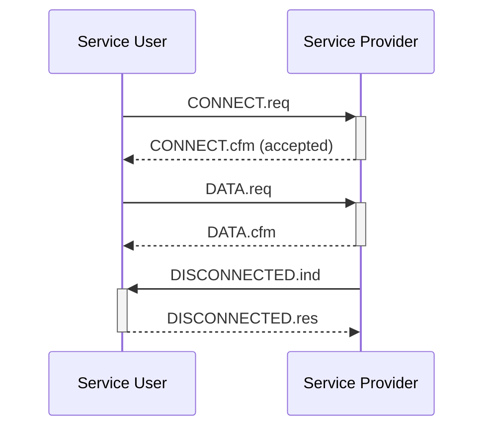
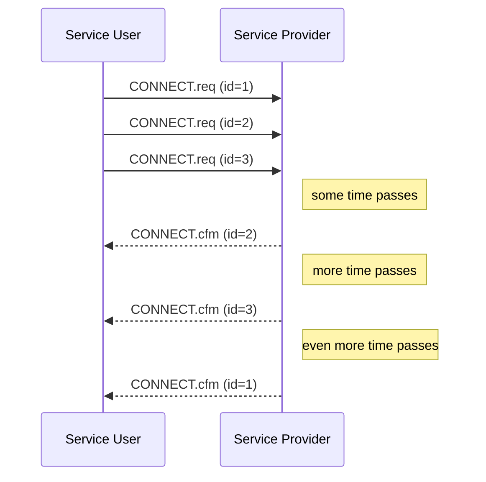
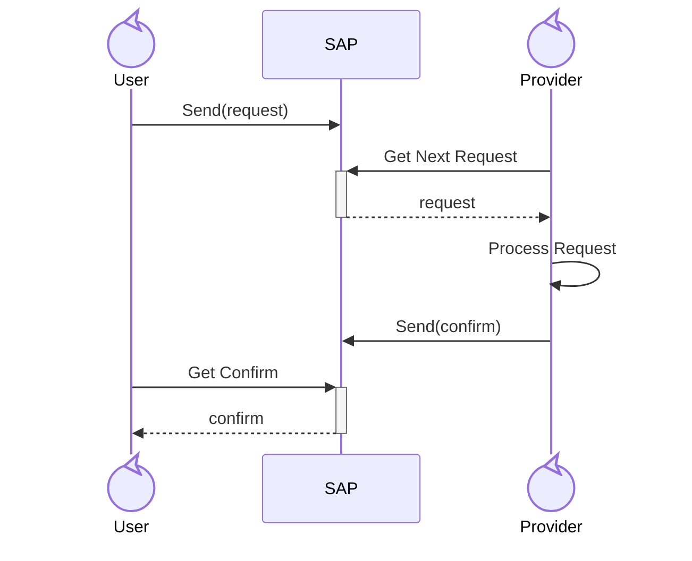
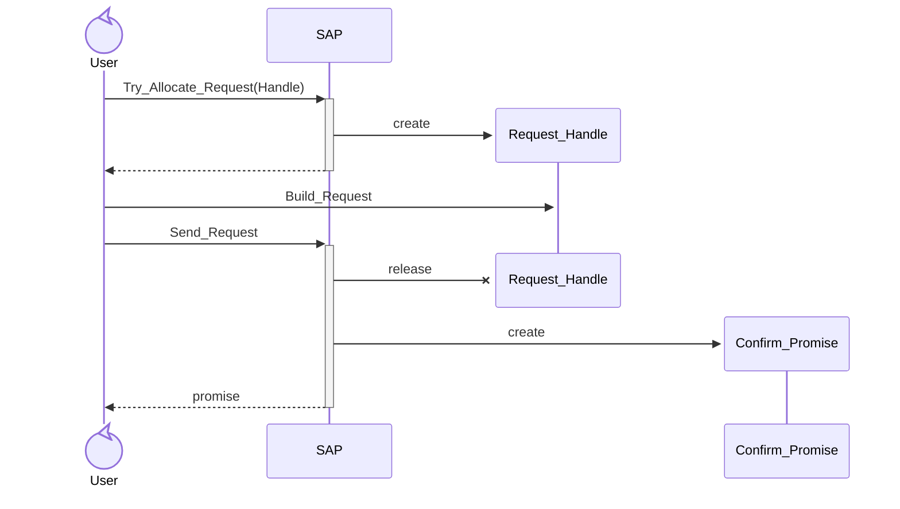
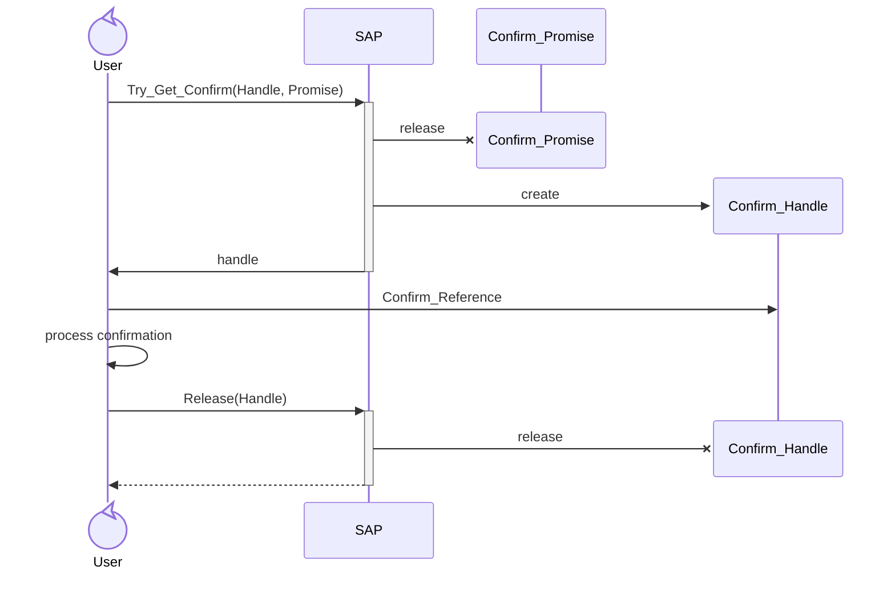
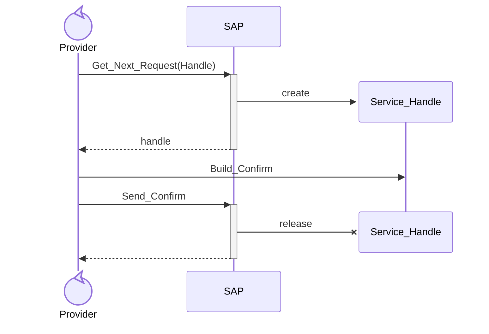

# LibSAP

LibSAP facilitates asynchronous zero-copy message-passing between tasks
(threads) by exchanging _Service Primitive_ messages via _Service Access Points_
(SAPs). It is designed for use in layered protocol stacks.

LibSAP is written in the SPARK programming language.

## License

Apache 2.0 with LLVM exception

## Service Primitives

Service Primitives are the standardised messages exchanged between adjacent
vertical layers in a protocol stack.
They represent a functional contract between a _Service Provider_
(the lower layer) and a _Service User_ (the higher layer).

The messages exchanged are based on four primitive types:
* **Request:** The Service User asks the Service Provider to perform a task
  (e.g., open a new connection).
* **Confirm:** The Service Provider notifies the Service User that a previous
  request has been completed (e.g., the connection has been established).
* **Indication:** The Service Provider informs the Service User of an event
  or incoming data (e.g., a request to establish a new connect has arrived).
* **Response:** The Service User acknowledges an indication (e.g., accept the
  new connection).

The following diagram shows an example of messages that might be logically
exchanged between a Service User and Service Provider:



Note that the _confirmation_ for a _request_ does not always come immediately
(likewise for a _response_ to an _indication_).
In some cases, the Service Provider needs some time to process the request
(e.g. wait for a connection to be established) before it can send the
confirmation.
The Service Provider might also respond to requests in a different order
than they were sent. For example, when opening multiple connections
concurrently, some connections might be established faster than others:



## Service Access Points

A _Service Access Point_ (SAP) is the conceptual interface where these messages
are exchanged between adjacent vertical layers in a protocol stack.
The interface to a logical protocol stack layer may consist
of multiple SAPs. For example, one SAP may be used to exchange control messages
(e.g. set up connections, setting parameters, etc) and another SAP may be used
to exchange dataProtocol Data Units (PDUs).

SAPs are the key building block provided by LibSAP. The library provides an
easy way to create SAPs based on user-defined Service Primitives, and allows
tasks to exchange those Service Primitives asynchronously between different
tasks.

The following sequence diagram illustrates the conceptual communication flow
between two tasks via a SAP created with LibSAP:


The SAP allows multiple transactions to be in-progress at the same, and
allows for multiple tasks to access the SAP concurrently.
Requests are queued in the SAP in first-in first-out (FIFO) order.

## LibSAP Features

* Zero-copy message passing.
* Bounded memory usage.
* Suitable for bare-metal embedded systems.
* Supports formal verification with SPARK.

LibSAP's API is designed so that it can only be used in the correct manner.
The SPARK tools (i.e., GNATprove) will catch any violations in the API usage
(provided that the Service User and Service Provider are written in SPARK).
In particular, the SPARK proofs ensure that:
* Resources are not leaked (i.e., users cannot forget to release resources
  before they go out of scope);
* If a Service User sends a request primitive that requires a confirm primitive,
  then it cannot forget to read the confirm primitive from the SAP.
* If a Service User sends a request primitive that does _not_ require a confirm,
  then it cannot try to read one from the SAP.
* If the Service Provider receives a request that expects a confirm, then it
  cannot forget to send one before completing its side of the transaction.

## Limitations


### Liveliness
While LibSAP is able to enforce correct API usage, it cannot guarantee
liveliness. That is, it cannot guarantee that a Service Provider task will
actually read and respond to requests. It is the user's responsibility to
ensure that their tasks respond to requests within the appropriate deadlines
for their system.

### Tasking Restrictions
LibSAP is written in SPARK and is therefore subject to the Jorvik tasking
profile and the sequential partition elaboration policy. These are set with
the following partition-wide pragmas:

```ada
pragma Profile (Jorvik);
pragma Partition_Elaboration_Policy (Sequential);
```

### Ownership Semantics on Primitives
Service Primitives transferred using LibSAP cannot have ownership semantics.

### Non-blocking API
Most of LibSAP's API calls are non-blocking, so LibSAP does not provide a way
for tasks to block (wait) for certain things to happen. In particular:
 * request allocation is non-blocking; and
 * getting a confirmation/response is non-blocking.

You can, however, build your own mechanisms (e.g., using protected objects) on
top of LibSAP to allow your tasks to wait for certain events to happen. The way
to do this depends on your tasks' behaviour and interactions, but the examples
show some ways that this can be done.

## API Concepts

The SAP manages its resources via _handles_. A handle is a token that grants
a Service User or Service Provider access to read and/or write a
Service Primitive (such as a request and/or confirmation primitive).
There are four types of handles:
 * A _Request Handle_ is granted to the Service User to build a request.
   It allows the Service User to write a request object to the SAP.
 * A _Confirm Promise_ is granted to the Service User after sending a request
   that requires a confirmation. The promise represents the eventual completion
   of the confirmation by the Service Provider. It allows the Service User
   to get a Confirm Handle when the confirmation has been sent by the Service
   Provider.
 * A _Confirm Handle_ is granted to the Service User when it reads a
   confirmation from the SAP. It allows the Service User to read the
   confirm primitive that was sent by the Service Provider.
 * A _Service Handler_ is granted to the Service Provider when it gets the
   next pending request from the SAP. It allows the Service Provider to read
   the request and generate a confirmation (if the request requires one).

## Examples

The examples below demonstrate the basic concepts of using LibSAP.

See the `examples` directory for some complete example programs.

### SAP Packages

LibSAP provides the following generic packages for defining _synchronous_ SAPs
that are safe to use in a multitasking context:
 * `LibSAP.Synchronous_Provider_Service_Access_Point` for SAPs using
    request/confirm primitives. I.e., communication from a _Service User_
    to a _Service Provider_.
 * `LibSAP.Synchronous_User_Service_Access_Point` for SAPs using
   indication/response primitives. I.e., communication from a
   _Service Provider_ to a _Service User_.

>[!NOTE]
>The User/Provider packages are functionally the same; they only differ in the
>terminology used (request/confirm or indication/response).
>The examples in this section uses request/confirm primitives to send requests
>to a Service Provider.

LibSAP also provides _light_ variants of the above SAPs, which lack protection
from data races so cannot be directly accessed by multiple tasks concurrently,
but are suitable for use in environments where Ada's tasking primitives are
not available (such as with the GNAT _light_ runtime profile):
 * `LibSAP.Light_Provider_Service_Access_Point`
 * `LibSAP.Light_User_Service_Access_Point`

### Defining a SAP

To define a SAP we need to define two types: `Request_Type` to describe
request primitives and `Confirm_Type` to describe confirm primitives.

Since there can be several different kinds of request primitives, its useful
to use a disciminated record to describe them. For example, consider a simple
Service Provider that can handle three kinds requests:
 * ECHO.req to request to echo an integer back in an ECHO.cfm
 * INCREMENT.req to request to increment an integer by a fixed amount and
   return it in an INCREMENT.cfm.
 * INCREMENT-SET.req to request to change the increment amount. It does not
   require a confirmation.

We can describe this in SPARK with the following:

```ada
   --  The set of possible request primitives
   type Request_Kind is (ECHO_Req, INCREMENT_Req, INCREMENT_SET_Req);

   --  Parameters for ECHO.req
   type ECHO_Req_Type is record
      Value_To_Echo : Natural := 0;
   end record;

   --  Parameters for INCREMENT.req
   type INCREMENT_Req_Type is record
      Value_To_Increment : Natural := 0;
   end record;

   --  Parameters for INCREMENT-SET.req
   type INCREMENT_SET_Req_Type is record
      New_Amount : Natural := 0;
   end record;

   --  Discriminated record to store any of the above request primitives
   type Request_Type (Kind : Request_Kind := Request_Kind'First) is record
      case Kind is
         when ECHO_Req =>
            ECHO_Req : ECHO_Req_Type := (others => <>);

         when INCREMENT_Req =>
            INCREMENT_Req : INCREMENT_Req_Type := (others => <>);

         when INCREMENT_SET_Req =>
            INCREMENT_SET_Req : INCREMENT_SET_Req_Type := (others => <>);
      end case;
   end record;
```

Next, we do the same for confirm primitives:

```ada
   -- The set of possible confirm primitives
   type Confirm_Kind is (ECHO_Cfm, INCREMENT_Cfm);

   --  Parameters for ECHO.cfm
   type ECHO_Cfm_Type is record
      Value : Natural := 0;
   end record;

   --  Parameters for INCREMENT.cfm
   type INCREMENT_Cfm_Type is record
      Value    : Natural := 0;
      Overflow : Boolean := False;
   end record;

   --  Discriminated record to store any of the above confirm primitives
   type Confirm_Type (Kind : Confirm_Kind := Confirm_Kind'First) is record
      case Kind is
         when ECHO_Cfm =>
            ECHO_Cfm : ECHO_Cfm_Type := (others => <>);

         when INCREMENT_Cfm =>
            INCREMENT_Cfm : INCREMENT_Cfm_Type := (others => <>);
      end case;
   end record;
```

>[!IMPORTANT]
> LibSAP requires `Request_Type` and `Confirm_Type` to be be definite,
> unconstrained types.

>[!IMPORTANT]
> LibSAP requires all fields in `Request_Type` and `Confirm_Type` to have
> default initialisation.

Next, we need to define two helper functions that helps LibSAP determine
when a confirmation is needed:

```ada
   --  Requires_Confirm is used to determine whether a request primitive
   --  requires the Service Provider to send a corresponding confirm primitive.
   --
   --  In this example, only ECHO.req and INCREMENT.req require a matching
   --  confirm primitive.

   function Requires_Confirm (Request : Request_Type) return Boolean
   is (Request.Kind in ECHO_Req | INCREMENT_Req);

   --  Valid_Confirm is used to check whether a confirm primitive is a correct
   --  response to a request primitive. In this example it is sufficient to
   --  simply check that the the message kind is correct, e.g. that a ECHO.cfm
   --  is sent in response to an ECHO.req.

   function Valid_Confirm
     (Request : Request_Type; Confirm : Confirm_Type) return Boolean
   is (case Request.Kind is
         when ECHO_Req          => Confirm.Kind = ECHO_Cfm,
         when INCREMENT_Req     => Confirm.Kind = INCREMENT_Cfm,
         when INCREMENT_SET_Req => False);
```

Now we have everything we need to create a SAP:

```ada
   package SAP is new
     LibSAP.Synchronous_Provider_Service_Access_Point
       (Request_Type     => Request_Type,
        Confirm_Type     => Confirm_Type,
        Requires_Confirm => Requires_Confirm,
        Valid_Confirm    => Valid_Confirm,
        Priority         => System.Priority'Last,
        Queue_Capacity   => 5);
```

>[!NOTE]
>`Priority` is the ceiling priority of the SAP. Only tasks whose priority
>is less than or equal to this priority may call the SAP.

>[!NOTE]
>`Queue_Capacity` is the maximum number of concurrent transactions that
>the SAP can handle. Increasing this value will increase memory usage.

### Sending a Request (Service User)

Sending a request consists of three steps:
1. Call `Try_Allocate_Request` to allocate a new Request Handle.
2. Call `Build_Request` to store the request via the handle.
3. Call `Send_Request` to queue the request in the SAP.

If the request requires the Service Provider to send back a confirmation, then
`Send_Request` will provide a valid Confirm Promise that can be used
to read the confirmation in the future.



```ada
procedure Send_Request_To_SAP is

   procedure Build_ECHO_Req (Request : out Request_Type) is
   begin
      Request := (Kind => ECHO_req, ECHO_Req => (Value_To_Echo => 123));
   end Build_ECHO_Req;

   procedure Build_Request is new SAP.Build_Request (Build_ECHO_Req);

   Req_Handle  : SAP.Request_Handle;
   Cfm_Promise : SAP.Confirm_Promise;

begin
   SAP.Try_Allocate_Request (Req_Handle);

   if not SAP.Is_Null (Req_Handle) then
      Build_Request (Req_Handle);
      SAP.Send_Request (Req_Handle, Cfm_Promise);

   else
      --  Failed to allocate a request. This happens when the SAP has no free
      --  resources to start a new transaction.

      Handle_Allocation_Failure;
   end if;

   --  This snippet omits the code to read the confirmation, so GNATprove
   --  would emit a warning that a resource leak occurs at the end of this
   --  scope since Cfm_Promise is dropped without reading the confirmation.

end Send_Request_To_SAP;
```

### Reading a Confirmation (Service User)

When that the Service User has a valid Confirm Promise, it can use it to get
a Confirm Handle that allows it to read the confirmation. The steps to do this
are:
1. Call `Try_Get_Confirm` to check if the confirmation has been sent by the
   Service Provider.
2. Call `Confirm_Reference` to get a pointer that observes the confirm
   primitive.
3. Call `Release` to release the Confirm Handle and complete the transaction.



```ada
procedure Example (Cfm_Handle : in out SAP.Confirm_Promise)
with Pre => not SAP.Is_Null (Cfm_Handle)
is
   Cfm_Handle : SAP.Confirm_Handle;
begin
   --  A real system would probably block on a protected entry until it is
   --  notified by the Service Provider that the confirmation is pending.
   --
   --  In this example, we just spin until the confirmation has been sent.

   loop
      SAP.Try_Get_Confirm (Cfm_Handle, Cfm_Promise);
      exit when not SAP.Is_Null (Cfm_Handle);
   end loop;

   --  Get a read-only pointer to access the confirmation data

   declare
      Confirm : constant not null access constant Confirm_Type :=
                  SAP.Confirm_Reference (Cfm_Handle);
   begin
      Process_Confirmation (Confirm.all);
   end;

   --  Release resources held by the handle.
   --
   --  If we forget to do this before Cfm_Handle goes out of scope then
   --  GNATprove will emit a warning.

   SAP.Release (Cfm_Handle);

end Example;
```

### Processing a Request (Service Provider)

The Service Provider processes a request by:
1. Call `Get_Next_Request` to get a Service Handle that holds the next pending
   request from a Service User.
3. Call `Request_Reference` and check what kind of request has been received.
2. Call `Build_Confirm`, which passes the request and confirm primitives
   to a user-defined procedure that reads the request and writes the confirm.
3. Call `Send_Confirm` if the request required a confirmation, or call
   `Request_Completed` if the request does not require a confirmation.



>[!NOTE] The Service Provider is not required to respond to the request
> immediately. It can save the handle elsewhere and process other requests
> in the meantime, before responding to the first request.

```ada
--  This example demonstrates using the SAP.Process_Request generic procedure
--  to process any kind of request.
--
--  SAP.Process_Request will call one of the following two procedures,
--  depending on whether the request requires a confirmation.

procedure Process_Request_No_Confirm (Request : Request_Type)
with
  Pre => not Requires_Confirm (Request);
--  Called to process a request that does not require a confirmation.

procedure Process_Request_With_Confirm
  (Request : Request_Type; Confirm : out Confirm_Type)
with
  Pre  => Requires_Confirm (Request) and then not Confirm'Constrained,
  Post => Valid_Confirm (Request, Confirm);
--  Called to process a request that requires a confirmation.
--
--  The procedure must write a valid confirmation to the Confirm output
--  parameter.

--------------------------------
-- Process_Request_No_Confirm --
--------------------------------

--  In this example, with ECHO.req INCREMENT.req, and INCREMENT-SET.req
--  primitives, only INCREMENT-SET.req does not require a confirmation,
--  so this procedure is only called for that primitive.

procedure Process_Request_No_Confirm (Request : Request_Type) is
begin
   case Request.Kind is
      when INCREMENT_SET_Req =>
         --  Code to process the INCREMENT-SET.req goes here

      when others            =>
         --  Unreachable since this procedure is only called on requests
         --  that do not require a confirm primitive.

         pragma Assert (False);
   end case;
end Process_Request_No_Confirm;

----------------------------------
-- Process_Request_With_Confirm --
----------------------------------

--  This procedure is only called for ECHO.req and INCREMENT.cfm since they
--  require a confirmation.

procedure Process_Request_With_Confirm
   (Request : Request_Type; Confirm : out Confirm_Type) is
begin
   case Request.Kind is
      when ECHO_Req      =>
         --  Code to process an ECHO.req and write to 'Confirm' goes here

      when INCREMENT_Req =>
         --  Code to process an INCREMENT.req and write to 'Confirm' goes here

      when INCREMENT_SET_Req        =>
         --  Unreachable since this procedure is only called on requests
         --  that require a confirm primitive.

         pragma Assert (False);
   end case;
end Process_Request_With_Confirm;

--  This is the actual code that reads a request from the SAP and services it:

procedure Service_Next_Request is

   procedure Process_Request is new
     SAP.Process_Request
       (Process_Request_No_Confirm,
        Process_Request_With_Confirm);

   Handle : SAP.Service_Handle;

begin
   SAP.Get_Next_Request (Handle);
   Process_Request (Handle);

   if SAP.Requires_Confirm (Handle) then
      SAP.Send_Confirm (Handle);

      --  Depending on your system's design, other code to notify the
      --  Service User task that the confirmation has been sent optionally goes
      --  here. For example, calling a protected procedure or setting a
      --  Suspension_Object to True.
   else
      SAP.Request_Completed (Handle);
   end if;
end Service_Provider_Task;
```