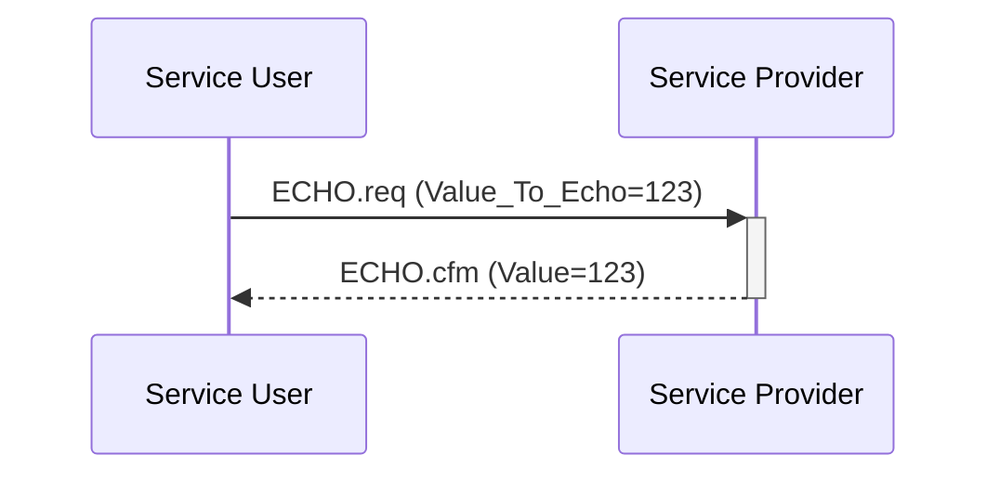

# Basic Example

This example demonstrates a single Service User communicating with a
single Service Provider, where each side is implemented in its own task.
The Service User is implemented in the environment task (`Main` in file
`main.adb`), and the Service Provider is implemented in task `
Service_Provider_Task` in `service_provider.adb`.

The example shows a simple flow of sending an ECHO.req to the Service Provider,
which responds with an ECHO.Cfm.



## Building

Building the program requires Alire:
```sh
alr build
```

## Running

```sh
alr run
```

>[!NOTE]
> You will need to force the program to exit with Ctrl+C since
> `Service_Provider_Task` does not exit (due to the requirements of the Jorvik
> tasking profile which prohibits tasks from terminating/returning).

## Proving

To formally verify the program with GNATprove:

```
alr exec -- gnatprove -P basic_example.gpr --level=2 -j0
```