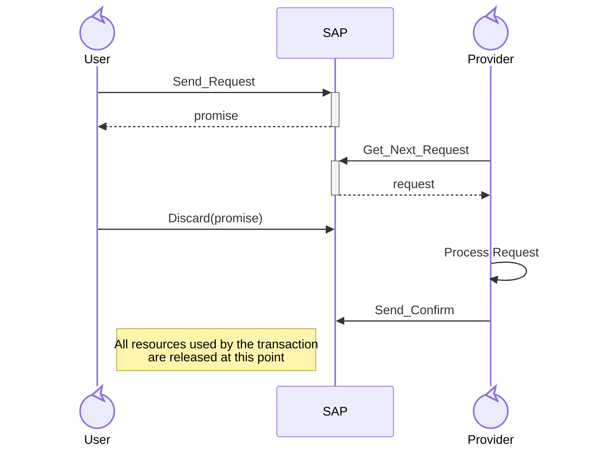

# Discard Example

This example demonstrates the use of `Discard` to throw away a `Confirm_Promise`.
This is useful in cases where a Service User sends a request that requires a
confirmation, but the Service User later decides that it no longer needs the
confirmation.
Instead of needing to keep the `Confirm_Promise` around (to avoid leaking
resources), the Service User can explicitly discard the promise to ensure that
the resources held will eventually be freed up automatically when the
confirmation is sent to the SAP.



## Building

Building the program requires Alire:
```sh
alr build
```

## Running

```sh
alr run
```

>[!NOTE]
> You will need to force the program to exit with Ctrl+C since
> `Service_Provider_Task` does not exit (due to the requirements of the Jorvik
> tasking profile which prohibits tasks from terminating/returning).

## Proving

To formally verify the program with GNATprove:

```
alr exec -- gnatprove -P discard_example.gpr --level=1 -j0
```