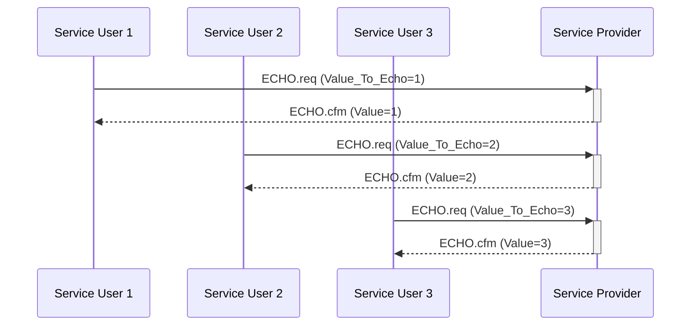

# Basic Example

This example demonstrates having multiple Service User tasks communicating with
a single Service Provider task.
The Service Users is implemented in the environment task (`Main` in file
`main.adb`), and the Service Provider is implemented in task `
Service_Provider_Task` in `service_provider.adb`.

The example shows three Service Users that each send an ECHO.req to one
Service Provider.



There is also an additional Log Service which wraps calls to `Ada.Text_IO`
to protect it from data races. This SAP only provides one primitive
(LOG.req) that does not require a confirmation. This service is used by all
other tasks in the system to log messages.

## Building

Building the program requires Alire:
```sh
alr build
```

## Running

```sh
alr run
```

>[!NOTE]
> You will need to force the program to exit with Ctrl+C since tasks
> do not exit (due to the requirements of the Jorvik profile).

## Proving

To formally verify the program with GNATprove:

```
alr exec -- gnatprove -P multiple_service_users.gpr --level=1 -j0
```