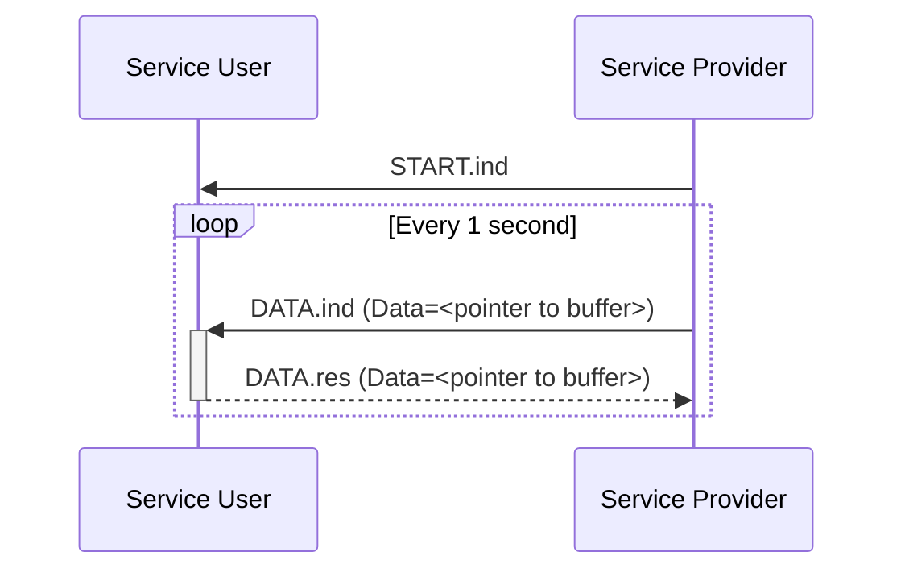

# Ownership Example

This example demonstrates transferring primitives that contain have ownership
semantics, such as pointers, while remaining formally verifiable with SPARK.

The example consists of a single Service Provider that sends indication
primitives to a single Service User. The Service Provider starts by sending
a `START.ind` primitive to notify that the service has started, then sends
a `DATA.ind` every one second, which requires a `DATA.res` response from the
Service User.

The `DATA.ind` and `DATA.res` primitives contain a single pointer parameter,
which has ownership semantics in SPARK. The pointer points to a buffer that
contains some data, and the Service User may move this pointer out of the
`DATA.ind` to perform some processing, then returns the pointer in the
`DATA.res` primitive.

For the purposes of this example, the Service User just moves ownership of the
pointer from the `DATA.ind` to the `DATA.res`, then sends the response to the
Service Provider.
The Service Provider then re-uses the same buffer to send the next request.

Thanks to SPARK's ownership rules, we are able to prove that the pointer is
not leaked and no unexpected aliasing is introduced.



## Building

Building the program requires Alire:
```sh
alr build
```

## Running

```sh
alr run
```

>[!NOTE]
> You will need to force the program to exit with Ctrl+C since
> `Service_Provider_Task` does not exit (due to the requirements of the Jorvik
> tasking profile which prohibits tasks from terminating/returning).

## Proving

To formally verify the program with GNATprove:

```
alr exec -- gnatprove -P ownership_example.gpr --level=1 -j0
```